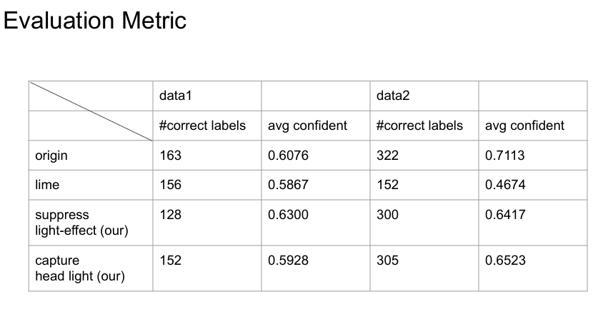

# Video Luminosity Enhancment for Automobiles

## Overview
We using modified LIME method to enhance the images and add flare removal method or catch car headlight method to increase the yolo object detection ability.

## Method

1. Convert vedio to frame images. 
2. Using frame images to pass modified LIME method in SuppressLightEffect_HaloMask file
3. Using enhance images to pass flare removal method __( SuppressLightEffect_HaloMask file)__ or catch car headlight method __(catch_headlight file)__
4. Detected by yolo and convert back to video.

## Result

Original video link : https://docs.google.com/file/d/16dDjwzIoPdayX0_K6tUIRwCn2LzRfiCp/preview

Halo mask video link : https://docs.google.com/file/d/1Wyj6yUVd1CJDsVVTPV2KQscit_w9fc76/preview

catch headlight video link :
https://docs.google.com/file/d/1_GYRLUOdpZWzDqPSrJgQc2F5abfRSeEr/preview

