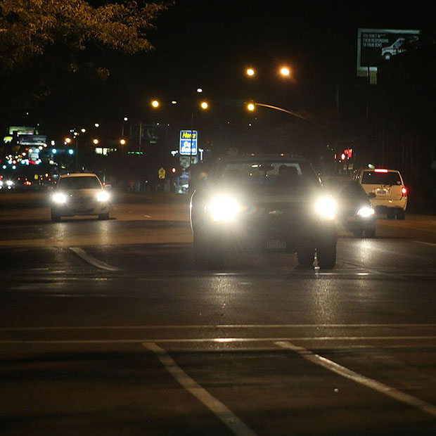
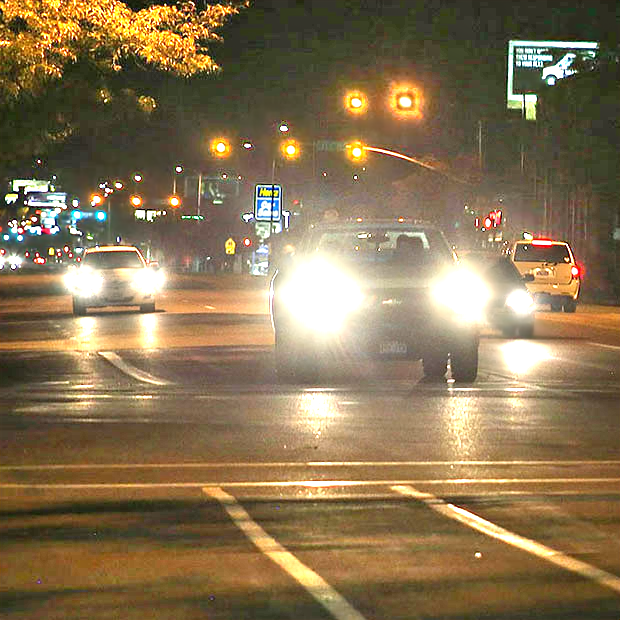
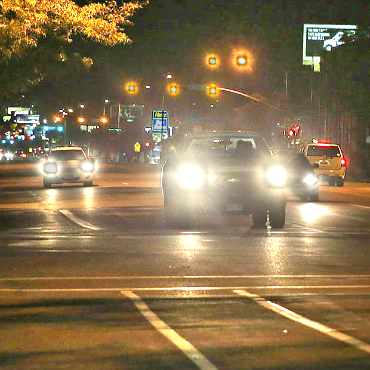

# Suppress Light-Effects with Halo Mask

## Overview
The basic [LIME](https://ieeexplore.ieee.org/stamp/stamp.jsp?tp=&arnumber=7782813) method and the advanced method [Low-Light Image Enhancement With Regularized Illumination Optimization and Deep Noise Suppression](https://ieeexplore.ieee.org/document/9163095) both struggle with overexposure issues in light areas, such as vehicle headlights, during low-light image enhancement. To address this limitation, we propose a novel solution that suppresses these light effects using a halo mask, derived from the detail image produced by the advanced method.

## Prerequisites
* __Python__ == 3.9.20
* __Matlab__ == 2024b
* __Pytorch__ == 2.5.1
* __Numpy__ == 1.26.4
* __MATLAB Engine API for python__

## File Structure
SuppressLightEffect_HaloMask/
│
├── data/                  # Dataset files
│   ├── input/             # image to process
│   ├── image_highway/     # our first dataset
│   ├── image_nightmarket/ # our second dataset
├── Result/                # Result files
│   ├── Result_highway/    # our first dataset result
│   ├── Result_nightmarket/# our second dataset result
├── checkpoint/            # Checkpoint for the denoise model
│   ├── checkpoint.pth.tar/
├── main.py                # Entry point for the program (our method)
├── origin.py              # Entry point for the paper's origin program
└── README.md              # Project documentation

## Usage
To process images with the proposed method, run the following command:
```bash
python main.py --input "data/input" --output "Result/" --maskratio 0.3
```
`--input`: Specify the folder containing input images.
`--output`: Specify the folder to save the processed results.
`--maskratio`: Control the degree of suppression for the light effect (e.g., 0.3 for moderate suppression).


## Experiment Results
Origin image:


Origin enhanced image:


Our result:


## Reference
- LIME: Low-Light Image Enhancement via Illumination Map Estimation [[paper]](https://ieeexplore.ieee.org/stamp/stamp.jsp?tp=&arnumber=7782813)
- Low-Light Image Enhancement With Regularized Illumination Optimization and Deep Noise Suppressio [[paper]](https://ieeexplore.ieee.org/document/9163095) [[github]](https://github.com/gy65896/Enhancement-Access)

