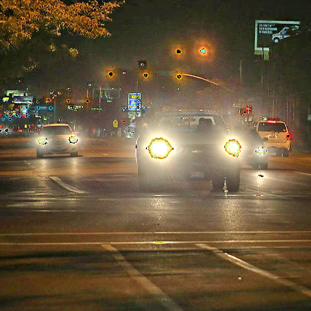
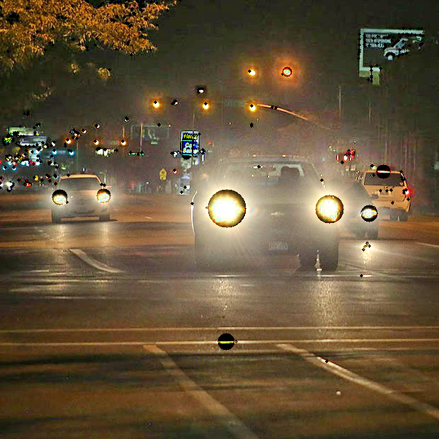

# Catch the healight

##  Overview
Due to the fact that the photos processed with lime treatment result in the car headlights being too bright, we try to using opencv api to catch the cars headlight and using gamma correction to let yolo focus on the cars.

## Requirement
* __Python__ == 3.9.20  
* __Numpy__ == 1.26.4 
* __OpenCV__ == 4.10.0.84 

## File Structure
```
catch_headlight/
│
└── demo/        # use to read images
    └── default/ # use to store original images
    └── enhance/ # use to store images be processed by LIME
└── enhance/     # use to store images br processed by main.py
```

## Usage
```bash
python main.py 
```

## Experiment Results

Original image:


Catch headlight without increasing headlight radius image:


Catch headlight using increasing radius method image:

